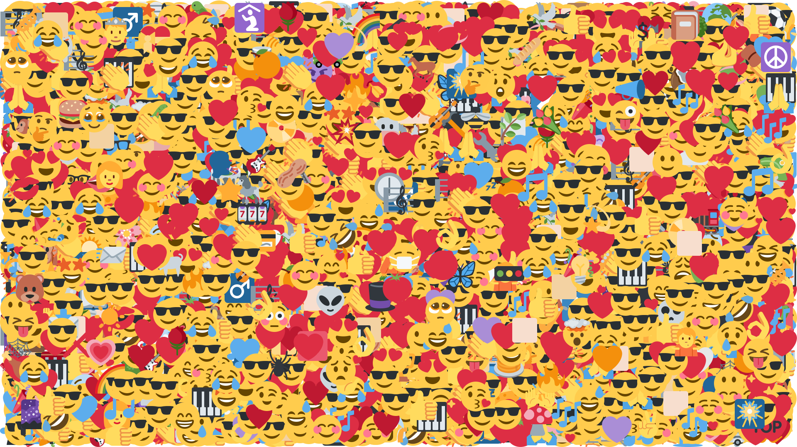

# Youtube comments analysis
The current project is built around YouTube comments for a given channel. It consist of a pipeline for comments extraction and multiple for comment analysis.

This projects experiments heavily with polars, but does use pandas for some sections, specially integration with plotting libraries.

Cloud of emojis example


### API key configuration
Make sure you get your API key from google console, you can place it in the file `.env` at the root of the project.

### YouTube channel selection
You can place the channel handle of your choice in the `config.py` file at the root of the project.

### Extraction
With the API key and the channel handle configured, the notebook `01_data_acquisition.ipynb` is the main pipeline for data extraction. It can be run on different days and accounts for the progress of previous days. Many of the functions that do the heavy lifting have been placed in `src/data_acquisition`.

### Analysis
Notebooks labeled `02` and `03` have the different kind of analyses performed, from simple profiling, to cloud of words, to language detection and sentiment analysis (and descriptive analysis from the sentiment scoring).

## Installation
1. **Install Conda**:
- [Miniconda (recommended, lighter)](//www.anaconda.com/docs/getting-started/miniconda/main) 
- [Anaconda](https://www.anaconda.com/download)

2. **Clone this project and navigate into the directory**:

```bash
git clone https://github.com/KstroO/youtube-text-analytics.git
cd youtube-text-analytics
```
3. **Create the environment**:

```bash
conda env create -f environment.yml
```

4. Activate the environment

```bash
conda activate youtube-nlp
```

## FUTURE WORK

Here are some of the topics that would have been interesting, but could have fit perfectly a project like this:

- Clustering and PCA
- Topic modeling with LDA
- Robust language detection, with transformer models
- Robust sentiment analyzer, with transformer models
- Toxicity detection, with transformer models
- Engagement analysis

## Licence Compliance
Because of licence compliance issues, I'm not allowed to upload the datasets of raw or
processed information to the internet. The project is built to account for this, it will create
the respective files to store the information extracted with the given api key.